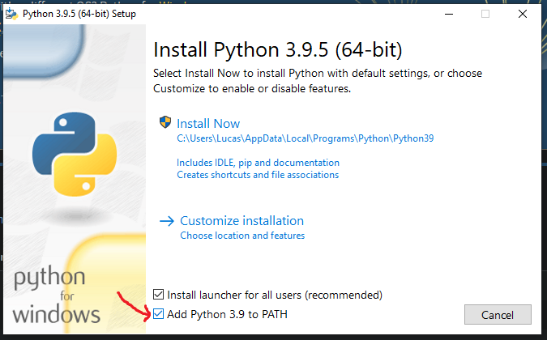
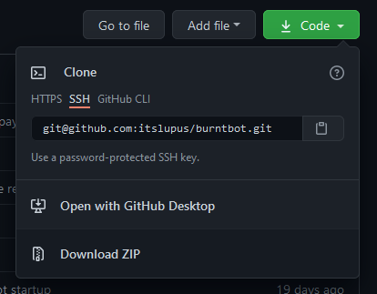
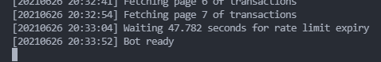
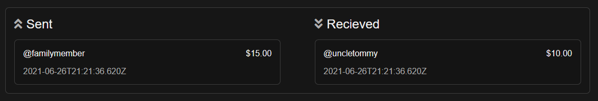
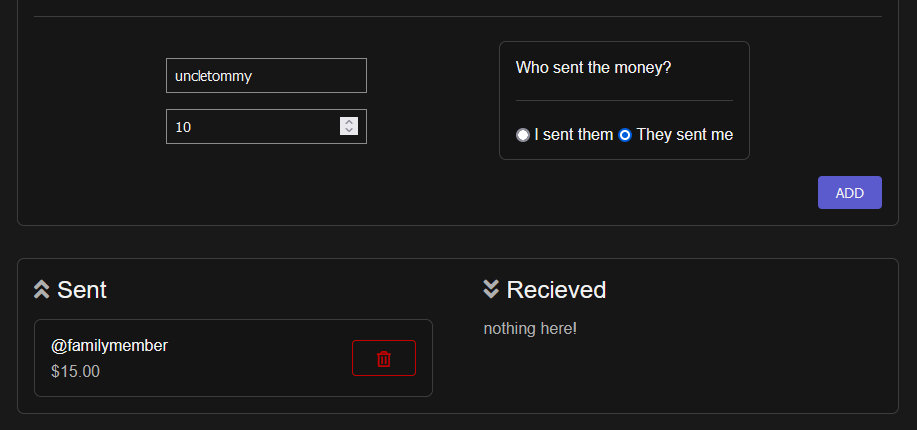

# burntbot - Installing
This install guide is written for Windows. The steps differ for MacOS and Linux distros, but the main idea is still there.

## Table of Contents
1. [Installing Python](#1-installing-python)
2. [Download the bot source code](#2-download-the-bot-source-code)
3. [Installing required packages](#3-installing-required-packages)
4. [Add people and their balances](#4-add-people-and-their-balances)
5. [Restart the bot to save changes](#5-restart-the-bot-to-save-changes)
6. [Restart the bot without listen mode](#6-restart-the-bot-without-listen-mode)

## 1. Installing Python
You need to install Python 3. It must be at least version 3.6. You can find a link to download the Python installer [here](https://www.python.org/downloads/). When you start the installer, make sure you check the option to include Python in the PATH. This will make the Python and `pip` executables run from anywhere.

>   
> The installer window with the PATH option highlighted.

## 2. Download the bot source code
Now download the source code of the bot and extract it somewhere. The zipped source code can be downloaded with [this link](https://github.com/itslupus/burntbot/archive/refs/heads/master.zip) or by clicking the green code button.

I would normally recommend using `git` to clone and fetch new updates, but that'll probably be too complex for some folks.

>   
> The `Download ZIP` button highlighted.

## 3. Installing required packages
Next we need to install the packages required to run the bot. Start by opening up a command prompt (or powershell) window in the same folder of the source of the bot. This can be done easily by typing `cmd` in the address bar.

Once a terminal window is open, type `pip install -r requirements.txt` to install the packages from the file.

> TODO: add gif here

## 4. Add people and their balances
Since not everyone is crazy and only swaps CAD with each other to move up the waitlist, some of you might have some money that you sent to a friend or vice versa. You need to tell the bot that, otherwise the bot might return that $10 uncle Tommy sent you for gas money.

To do this, first start up the bot in listen mode. This mode will not return any money to anyone. Do this by typing `python start.py --listen`. Now, you will need to wait until the bot says that it is ready, this will happen when it is finished fetching your transactions.

>   
> The bot in the ready state

Now go to [http://localhost:5000](http://localhost:5000). You will see a home page. If you sent or received money, it will appear in the balances section. These are the shaketags and amounts you need to add to the blacklist.

>   
> Two people that need to be blacklisted

Go to the blacklist page from the navigation on the left hand side, or go to [http://localhost:5000/blacklist](http://localhost:5000/blacklist). This is where you will add those shaketags and balances.

>   
> Blacklisting uncletommy's $10 transaction to us

## 5. Restart the bot to save changes
Restart the bot now to save changes. Do this by pressing `ctrl` and `c` on your keyboard while in the command window. Now retype the command from step 4, or hit the up arrow to recall the previous command. Start the bot again in listen mode and wait for the bot to start.

Once the bot is restarted, go to the website and check if the names you blacklisted are still there. If they are not, then go onto the final step!

## 6. Restart the bot without listen mode
Like in step 5, stop the bot. Now, run the bot without any flags by entering `python start.py`. This will start the bot without listen mode, which means that it will start returning swaps.

If you've made it this far, congratulations on your new auto-return bot.