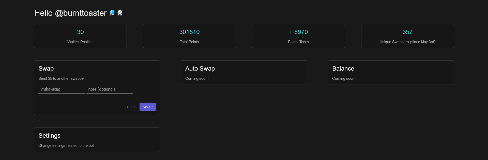

<div align = center>
	<h1>SwapPong</h1>
	<p>Mange the automatic returns and initiations of swaps with SwapPong, a Python bot.</p>
</div>


## Requirements
This project is written for Python 3.6+. Required packages can be found in `requirements.txt` and can be installed using `pip3`.

```
pip3 install -r requirements.txt
```

The usage of a [virtual environment](https://docs.python.org/3/library/venv.html#module-venv) is recommended.

## Usage
You can start the bot by invoking with the the Python executable
```
python3 start.py
```
Additionally, startup flags can be used:
```
python3 start.py -v		# verbose logging mode: more debug messages
python3 start.py -l		# listen mode: the bot will not auto-return swaps
python3 start.py -v -l	# verbose and listen: a combination of the above
```

## Contributing
Missing a feature you want? Something broken? Create an issue or pull request and help grow this project.

## License
This entire project is licensed under AGPL-3.0-or-later.